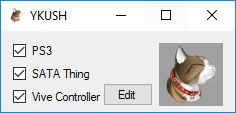
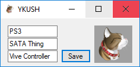
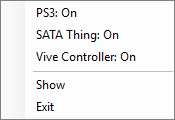

# YKUSH GUI

This is an unofficial GUI for the YKUSH devices (specifically the original 3-port YKUSH) made for personal use.

## Features

- toggle ports on and off

- simple and persistent port-renaming functionality

- minimize to tray and a tray icon for always-there toggling

- a cat

## Screenshots

Normal view:

Edit mode for changing device labels:

Tray icon right-click menu:

## Building

Grab a copy of the [ykushcmd package](https://www.yepkit.com/learn/setup-guide-ykush-windows) and place it at `./GhettoYkushGui/ykushcmd`. The executable should be located at `./GhettoYkushGui/ykushcmd/bin/ykushcmd.exe`

